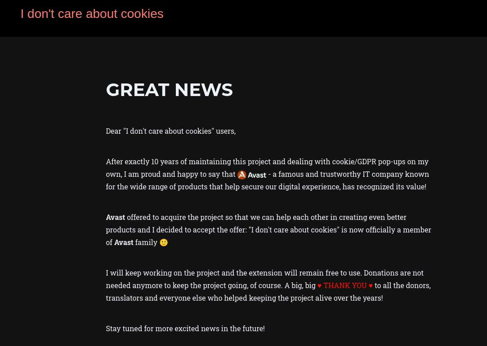

# A backup of the "I Don't Care About Cookies" extension
Browser extension [idontcareaboutcookies](https://www.i-dont-care-about-cookies.eu/) recently sold out to Avast, the trashy antivirus company that bought out (and ruined) Piriform CCleaner (and the rest of their products). This is a backup of the last good version before the acquisition, **v3.4.2.0**

That said, no malicious/advertising changes have been confirmed yet.

## Usage:

In this repo, go into the folder for your browser and download the relevant extension file. 

In Chrome-based browsers, you'll need to go into [chrome://extensions](chrome://extensions) and drag'n'drop the CRX. You may need to enable "Developer Mode". If that doesn't work, rename the CRX to ZIP, extract it somewhere permanent on your HDD, and then, from [chrome://extensions](chrome://extensions) with Developer Mode enabled, **Load unpacked extension** and browse to where you unzipped the extension. Modern Chrome and Edgium will nag you on launch about developer mode extensions; if this annoys you, either [follow these hacky steps](https://stackoverflow.com/questions/23055651/disable-developer-mode-extensions-pop-up-in-chrome), or use [Ceiridge's Patcher](https://github.com/Ceiridge/Chrome-Developer-Mode-Extension-Warning-Patcher) or switch to a developer/beta version of the browser or a fork like [Ungoogled Chromium](https://chromium.woolyss.com/). 

For Firefox, switch to [Extended Service Release](https://www.mozilla.org/en-US/firefox/all/#product-desktop-esr) (recommended) or Developer/Nightly (not recommended), goto `about:config` and set `xpinstall.signatures.required` to `false`, then drag'n'drop the XPI to install it. ([Source](https://stackoverflow.com/questions/31952727/how-can-i-disable-signature-checking-for-firefox-add-ons))

## Future development
- OhMyGuus is developing a FOSS fork of idontcareaboutcookies here: https://github.com/OhMyGuus/I-Dont-Care-About-Cookies
- If anyone can test and confirm that 3.4.3 (or later) versions of the original idontcareaboutcookies **are OK** and do not have Avast code added, then the backup here will be updated.
- If anyone can provide any of the missing extension versions, they will also be included. See [below](/README.md#missing)

## Sources:
- [Palemoon](https://addons.palemoon.org/?component=download&id=jid1-KKzOGWgsW3Ao4Q@jetpack&version=3.4.2)
- [Chrome](https://chrome.google.com/webstore/detail/i-dont-care-about-cookies/fihnjjcciajhdojfnbdddfaoknhalnja), grabbed with the following bookmarklet on 15/09/22:
```
javascript:location.href='https://clients2.google.com/service/update2/crx?response=redirect&acceptformat=crx2,crx3&prodversion='+(navigator.appVersion.match(/Chrome\/(\S+)/)[1])+'&x=id%'+'3D'+(document.querySelector('a[href^="https://chrome.google.com/webstore/report/"]').pathname.match(/[^\/]+\/*$/)[0])+'%'+'26installsource%'+'3Dondemand%'+'26uc';
```
- Firefox: Mozilla served me the wrong file before; thankfully I found I still had an XPI of **idontcareaboutcookies v3.4.2** in my Firefox user profile folder `\AppData\Roaming\Mozilla\Firefox\Profiles\gd1acr8t.default-esr\extensions\jid1-KKzOGWgsW3Ao4Q@jetpack.xpi`
- [Filterlist](https://www.i-dont-care-about-cookies.eu/abp/) (this seems to have a different version string, and is more transparent than the extension. I only got v343, [Archive.org](https://web.archive.org/web/20220000000000*/https://www.i-dont-care-about-cookies.eu/abp/))

## Missing:
- Opera
- Edgium

I wasn't fast enough to grab v3.4.2.0 of any of those browser's versions, but the Chromium version of the extension should work fine on Opera and Edgium. 

For Firefox, Mozilla still [serves a file numbered v3.4.2](https://addons.mozilla.org/firefox/downloads/file/4002797/i_dont_care_about_cookies-3.4.2.xpi), but this is a misnomer as I discovered to my chagrin - opening it up and checking the manifest reveals it is v3.4.3; even [Archive.org](https://web.archive.org/web/20220915182141/https://addons.mozilla.org/firefox/downloads/file/4002797/i_dont_care_about_cookies-3.4.2.xpi) seems to only have a single snapshot of this wrongly-named version. **Update: I found I had an XPI of v3.4.2 in my Firefox extensions cache, which I have now included.** If that doesn't work, all I can suggest is trying the Palemoon version, since Palemoon is a Firefox fork, it might work. Requires extension signing OFF.

## News:
- [Official acquisition announcement](https://www.i-dont-care-about-cookies.eu/whats-new/acquisition/) ([Archive.org](https://web.archive.org/web/20220915150131/https://www.i-dont-care-about-cookies.eu/whats-new/acquisition/), [Archive.today](https://archive.ph/Xb0At))
- [CK's Technology News announcement](https://twitter.com/CKsTechNews/status/1570406615597338625) ([Archive.today](https://archive.ph/fiVH3)

## Screenshots



