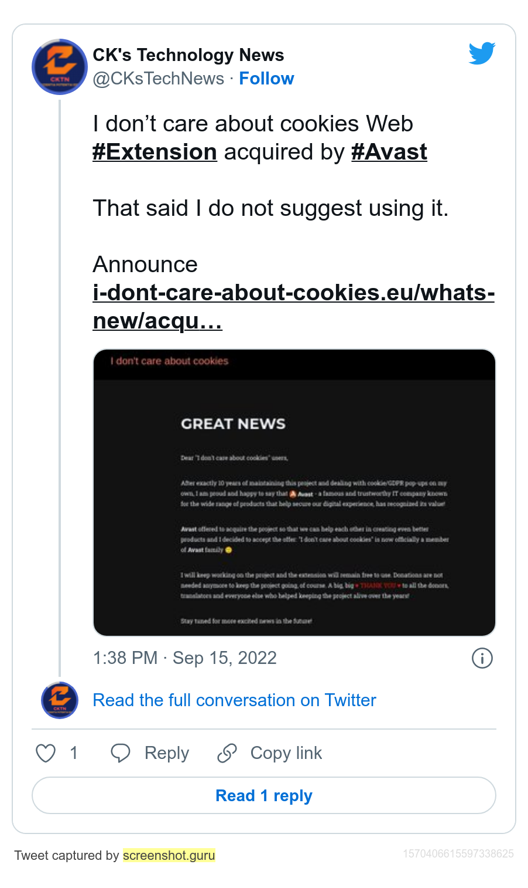

# idontcareaboutcookies-backup
Browser extension idontcareaboutcookies recently sold out to Avast, the trashy antivirus company that bought out (and ruined) Piriform CCleaner (and the rest of their products). This is a backup of the last good version before the acquisition, **v3.4.2.0**

That said, no malicious/advertising changes have been confirmed yet.



## Sources:
- [Palemoon](https://addons.palemoon.org/?component=download&id=jid1-KKzOGWgsW3Ao4Q@jetpack&version=3.4.2)
- [Chrome](https://chrome.google.com/webstore/detail/i-dont-care-about-cookies/fihnjjcciajhdojfnbdddfaoknhalnja), grabbed with the following bookmarklet on 15/09/22:
```
javascript:location.href='https://clients2.google.com/service/update2/crx?response=redirect&acceptformat=crx2,crx3&prodversion='+(navigator.appVersion.match(/Chrome\/(\S+)/)[1])+'&x=id%'+'3D'+(document.querySelector('a[href^="https://chrome.google.com/webstore/report/"]').pathname.match(/[^\/]+\/*$/)[0])+'%'+'26installsource%'+'3Dondemand%'+'26uc';
```
- [Firefox](https://addons.mozilla.org/firefox/downloads/file/4002797/i_dont_care_about_cookies-3.4.2.xpi)
- [Filterlist](https://www.i-dont-care-about-cookies.eu/abp/) (this seems to have a different version string, and is more transparent than the extension. I only got v343, [Archive.org](https://web.archive.org/web/20220000000000*/https://www.i-dont-care-about-cookies.eu/abp/))

## Missing:
- Opera
- Edgium

I wasn't fast enough to grab v3.4.2.0 of either of those browser's versions, but the Chromium version of the extension should work fine.

## News:
- [Official acquisition announcement](https://www.i-dont-care-about-cookies.eu/whats-new/acquisition/) ([Archive.org](https://web.archive.org/web/20220915150131/https://www.i-dont-care-about-cookies.eu/whats-new/acquisition/), [Archive.today](https://archive.ph/Xb0At))
- [CK's Technology News announcement](https://twitter.com/CKsTechNews/status/1570406615597338625) ([Archive.today](https://archive.ph/fiVH3)